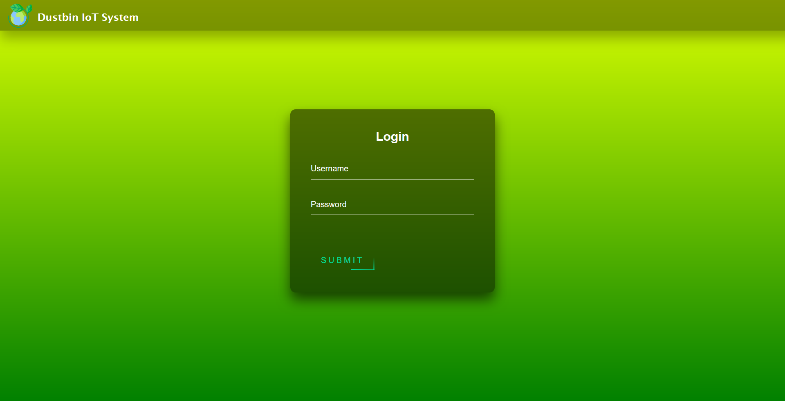
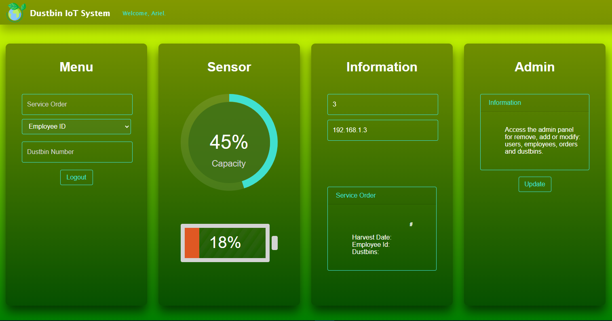

# Dustbin IoT System

### Intelligent system for managing the refuse collection of a Smart City.

The administrator can add, modify or delete: orders, employees, dustbins or new accesses to the web application.
Each user sees his own orders and the level of filling of the dustbins to collect.
Expired orders will not be displayed automatically.

**Technologies and requirements:**

- Python | https://www.python.org/downloads/
- PostgreSQL as DB | https://www.postgresql.org/download/
- Django as Framework | `$ pip install Django`

 

 

